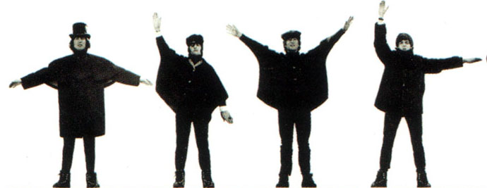

# Preliminaries

## 

https://etherpad.net/p/hpcboot-bash

## Help

- chat
- stickies
- helpers
- neighbors



## Get data

swcarpentry.github.io/shell-novice/shell-novice-data.zip

1. Download .zip file
2. Extract onto Desktop
3. Verify that you have a folder called `data-shell`
4. Green sticky when done

## Open a terminal emulator {data-background="img/terminal-dark.jpg"}

**Macintosh**

Cmd+space: terminal

**Windows**

Windows key, then type "Git Bash" and press enter

# Navigation {data-background="img/navigation-dark.jpg"}

## Key commands

Print working directory

`pwd`

Change directory

`cd`

List directory contents

`ls`

## Handy arguments to `ls`

```
ls -a     # shows all

ls -l     # long form

ls -h     # human readable

ls -F     # appends indicators

ls -Fahl
```

## Man pages (`q` to exit)

```
man ls
```


## The home directory

```
cd ~
```

**Macintosh**: /Users/max/

**Windows**: /c/Users/max/

**Linux**: /home/max/

## The root directory


## What's in your root directory?  {data-background=#990000}

**Challenge:**

List the contents of your root directory *without navigating to it*

i.e., do not use `cd`

## Solution {data-background=#990000}

`ls /`

## Relative vs. absolute paths

Relative:

```
cd ~ 

cd Desktop

cd ../Documents
```

Absolute:

```
cd /Users/max/Desktop
```

## Challenge {data-background=#990000}

How do you change directories from your Desktop to your root directory using relative paths?

## Solution {data-background=#990000}

cd ../../..


## Relative path resolution {data-background=#990000}

`pwd` displays `/Users/thing`

What will `ls ../backup` display?


